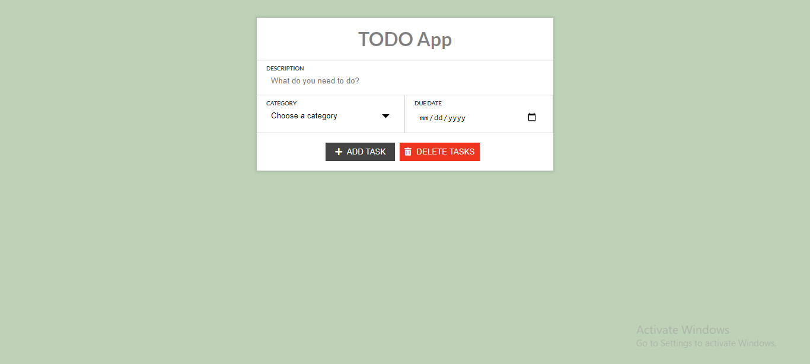
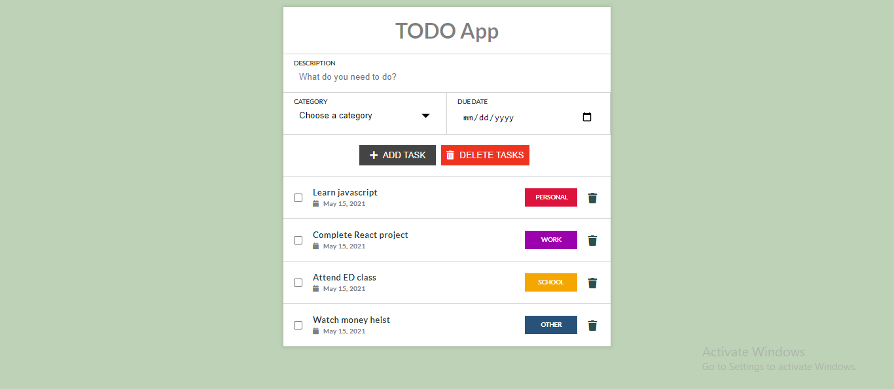
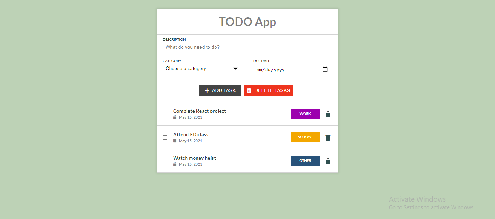
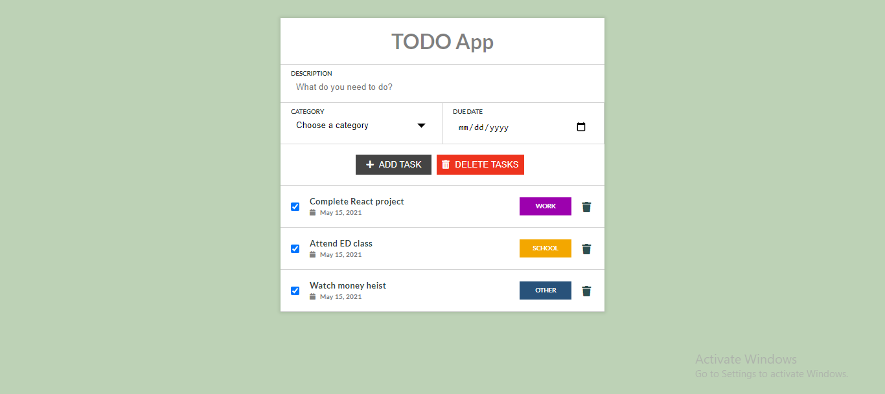

# ToDo-App

### User can
- Create a todo task.
- Delete a todo task.
- See the added todo tasks.
- Complete a todo task.
- Complete all todo task.
- Delete all task together.
- Add task according to different category.
- Add task according to date.

### Technical Exposure
- Node.js
- Expressjs
- MongoDB
- Ejs
- CSS

### Screenshot

